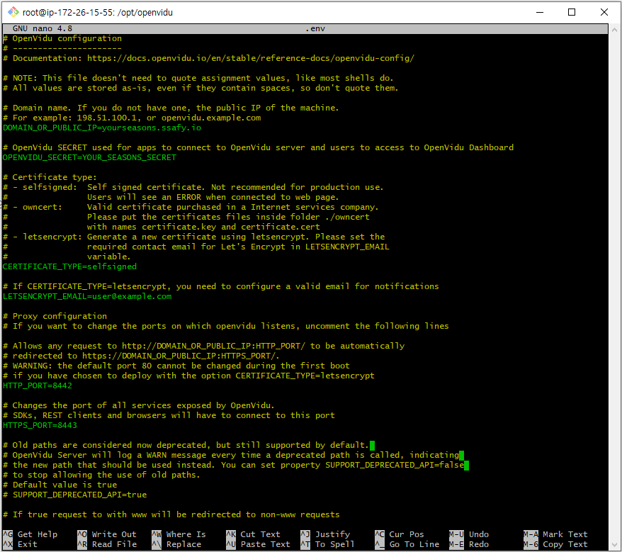
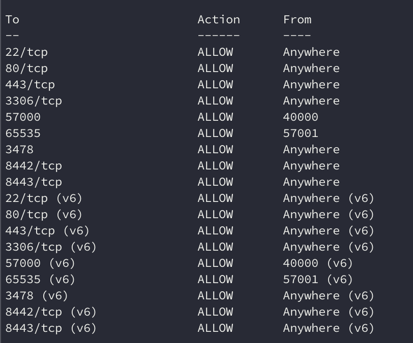
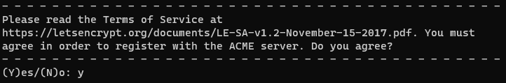
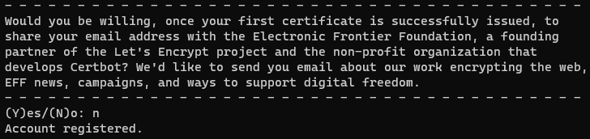
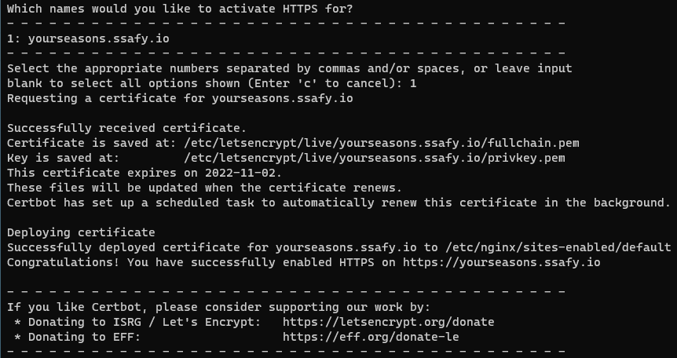

## 개발 환경 세팅

```bash
/* apt를 최신 상태로 업데이트 */
$ sudo apt update
```

### 1. JDK 설치

```bash
/* openjdk-8 설치 */
$ sudo apt install openjdk-8-jdk

/* java 버전 확인 */
$ java -version

/* java 버전 변경 */
$ sudo update-alternatives --config java
```

### 2. Java 환경 변수 설정

```bash
$ sudo vim /etc/profile
```

아래 내용을 /etc/profile의 가장 아래 추가

```
export JAVA_HOME=/usr/lib/jvm/java-8-openjdk-amd64
export PATH=$JAVA_HOME/bin:$PATH
export CLASSPATH=$CLASSPATH:$JAVA_HOME/jre/lib/ext:$JAVA_HOME/lib/tools.jar
```

아래 명령어로 환경변수가 제대로 세팅됐는지 확인

```bash
$ echo $JAVA_HOME
```

### 3. nodejs 설치

```bash
$ sudo apt install nodejs
$ sudo apt install npm /* 노드 패키지 매니저 설치 */
$ sudo npm install -g n latest /* node 최신 버전으로 업데이트 */
$ sudo npm install -g npm /* npm 최신 버전으로 업데이트 */
```

### 4. nginx

#### 설치

```bash
$ sudo apt update
$ sudo apt install nginx
```

#### 실행

```bash
$ sudo service nginx start

/* 혹은 */
$ sudo systemctl start nginx /* nginx 실행 */
$ sudo systemctl status nginx /* nginx 상태 확인 */
```

#### 구동 테스트

```bash
$ sudo netstat -lntp

/* netstat 명령어가 없으면 net-tools 설치 */
$ sudo apt install net-tools
```

80번 포트가 리스닝되고 있으면 실행 상태

### 5. Docker 설치

```bash
$ sudo apt install docker.io
```

### 6. MySQL 설치
```bash
$ docker pull mysql
$ docker run --name mysql-container -p 3306:3306 -e MYSQL_ROOT_PASSWORD=yourseasons -e MYSQL_DATABASE=yourseasons -d mysql --character-set-server=utf8 --collation-server=utf8_general_ci
```

## Openvidu 배포
```bash
// root permission
$ sudo su 

// recommended folder
$ cd opt/

// install openVidu
curl https://s3-eu-west-1.amazonaws.com/aws.openvidu.io/install_openvidu_latest.sh | bash
// docker-compose 문제

// configure .env
$ cd openvidu/
$ nano .env

// .env  설정은 아래와 같이 
// start openvidu
$ ./openvidu start
```

- .env 설정 파일


- 포트 설정
```bash
$ sudo ufw allow 3478
$ sudo ufw allow from 40000 to any port 57000
$ sudo ufw allow from 57001 to any port 65535
$ sudo ufw enable
$ sudo ufw status
```



##
## HTTPS 적용 (SSL)

1. 방화벽 설정

    ```bash
    $ sudo apt update
    $ sudo apt install ufw
    $ sudo ufw allow ssh
    $ sudo ufw allow http
    $ sudo ufw allow https
    $ sudo ufw enable
    $ sudo ufw status
    ```

   

2. Snap 설치

    ```bash
    /* snapd 설치 */
    $ sudo apt update
    $ sudo apt install snapd
    
    /* core snap 설치 */
    $ sudo snap install core
    $ sudo snap refresh core
    ```

3. Certbot 설치

    ```bash
    $ sudo apt remove certbot
    $ sudo snap install --classic certbot
    $ sudo ln -s /snap/bin/certbot /usr/bin/certbot
    ```

4. SSL 인증서 요청

    ```bash
    $ sudo certbot --nginx
    $ sudo certbot certonly --nginx
    ```

  - 이메일 입력 후 엔터

    

  - 동의(y) 입력 후 엔터

    

  - 이메일 수신 - 비동의(n) 입력 후 엔터

    

  - https를 적용할 도메인 선택 후 엔터

    


## 프로젝트 배포
**버전 정보**

IDE
- Intellij 2021.1.3

JVM
- oOpenjdk 1.8

배포 라이브러리
- Gradle 7.4.1

### 1. 프로젝트 설치
```bash
$ git clone https://lab.ssafy.com/s07-webmobile1-sub2/S07P12B305.git
```

### 2. Redis 설치
- 설치

    ```bash
    $ sudo apt install redis-server
    ```

- redis.conf 파일 수정

    ```bash
    $ sudo vim /etc/redis/redis.conf
    ```

    | redis.conf 파일
    ```
    maxmemory 1g
    maxmemory-policy allkeys-lru
    bind 0:0:0:0
    ```

- Redis 재실행

    ```bash
    sudo service redis-server restart
    ```


- Redis 서버 접속 및 테스트

    ```bash
    redis-cli
    
    set [key] [value]
    get [key]
    ```
  
### 3. 프론트엔드 빌드 및 배포
- 프로젝트 폴더 내에 있는 frontend 디렉토리의 루트 경로에서 다음 명령어를 실행합니다.
- deploy.sh 파일에는 프론트엔드 빌드 및 도커라이징하는 코드가 들어있습니다.

```bash
$ sh deploy.sh
```

#### 설정 파일

| Dockerfile
```java
# nginx 이미지를 사용합니다. 뒤에 tag가 없으면 latest 를 사용합니다.
FROM nginx

# root 에 app 폴더를 생성
RUN mkdir /app

# work dir 고정
WORKDIR /app

# work dir 에 build 폴더 생성 /app/build
RUN mkdir ./build

# host pc의 현재경로의 build 폴더를 workdir 의 build 폴더로 복사
ADD ./build ./build

# nginx 의 default.conf 를 삭제
RUN rm /etc/nginx/conf.d/default.conf

# host pc 의 nginx.conf 를 아래 경로에 복사
COPY ./nginx.conf /etc/nginx/conf.d

# 80 포트 오픈
EXPOSE 80

# container 실행 시 자동으로 실행할 command. nginx 시작함
CMD ["nginx", "-g", "daemon off;"]
```

| nginx.conf
```
    server {
        listen 80;
        listen [::]:80;
    
        location / {
            root  /app/build;
            index index.html;
            try_files $uri $uri/ /index.html;
        }
    }
```

### 3. 백엔드 빌드 및 배포
- 프로젝트 폴더 내에 있는 backend 디렉토리의 루트 경로에서 다음의 명령어를 실행합니다.
- deploy.sh 파일에는 백엔드 빌드 및 도커라이징하는 코드가 들어있습니다.

```bash
$ sh deploy.sh
```

#### 설정 파일
| Dockerfile
```
FROM openjdk:8

EXPOSE 8080

ARG JAR_FILE=build/libs/backend-0.0.1-SNAPSHOT.jar

COPY ${JAR_FILE} app.jar

ENTRYPOINT ["java", "-jar", "/app.jar"]

ENV TZ=Asia/Seoul
RUN apt-get install -y tzdata
```